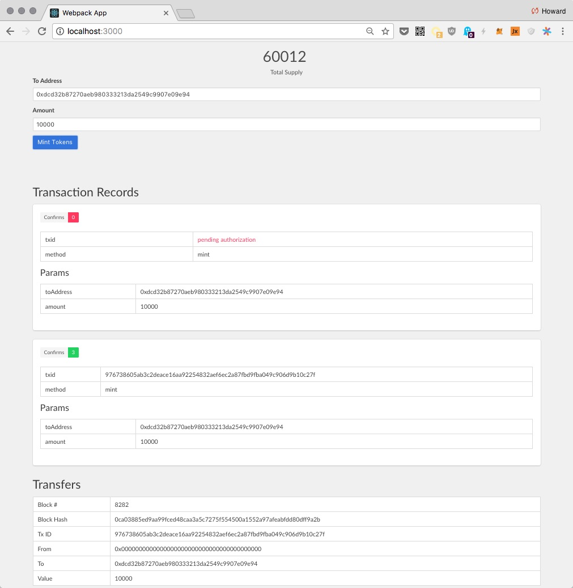
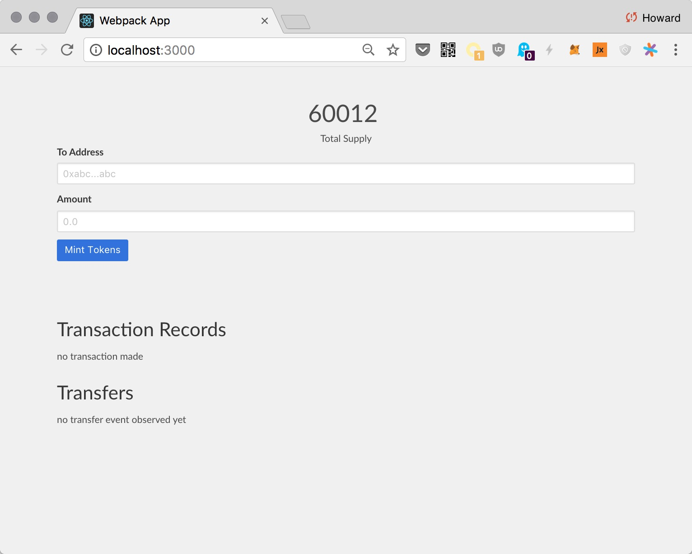
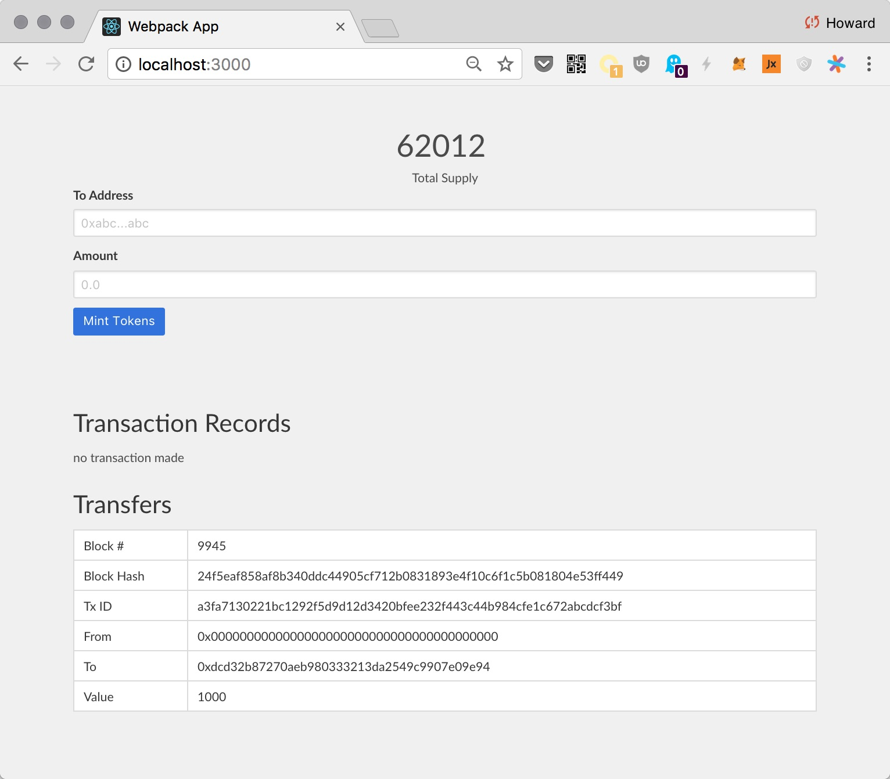

# ERC20 DApp

In this chapter, we'll build a React DApp for the [ERC20 Token we deployed previously](./erc20-token.md).

The features for this DApp are similar to the NodeJS CLI tool we've built. The DApp should:

+ Subscribe to and display token transfer events.
+ Display total supply, and update it automatically.
+ Be able to mint new tokens.
+ Display information about transactions made, e.g. number of confirmations.

It looks something like this:



The only additional complication is that we no longer allow DApp to create a transaction without user permission. Now for every transaction, we should give the user an opportunity to approve or deny it:


The ERC20 DApp is more complex than the CLI App, because it needs to track multiple transactions, and update the UI when a new confirmation occurs.

We will use [mobx.js](https://mobx.js.org/), a reactive programming framework, to keep data and view synchronized.

You can get the code at [qtumproject/qtumjs-dapp-erc20](https://github.com/qtumproject/qtumjs-dapp-erc20), and use it to jump start your own DApp project.

# Brief Intro To Reactive Programming

Most of the complexity in GUI programming is in synchronizing the underlying data and the UI state. When data changes, the UI also needs to change. Conversely, when the UI changes (say user inputs a number), the data needs to change.

It is tedious and error-prone to keep the UI and data in sync.

It'd be nice to bind the UI and data, so they always change together. `mobx` provides the tool to do that, and it is almost indistinguishable from magic.

Let's first see how we manually update UI without reactive programming, then we'll see how mobx automates that process.

## Manual UI Update

Suppose the data is:

```js
const obj = {
  a: 1,
  b: 2,
}
```

We read the data in a view rendering function:

```jsx
function renderView(obj) {
  const view = (
    <div>
      a: {obj.a}
      <br/>
      b: {obj.b}
    </div>
  )
  ReactDOM.render(view, document.querySelector("#root"))
}
```

Now we update the data:

```js
obj.a = 10
```

Next, we'll need to manually call `renderView` again to refresh:

```js
renderView(obj)
```

If we forget to rerender, the view would be stale. In a complex application, there could be many different views using different pieces of data. It's a big challenge to keep track of everything correctly.

## Reactive UI Update

Instead of calling `renderView` manually, we'd like it to be called automatically when we modify the object, like so:

```js
obj.a = 10
// ✨✨✨ the view automagically updates ✨✨✨
```

To accomplish this, `mobx` introduces two magic functions:

+ [observable](https://mobx.js.org/refguide/observable.html): If you modify an observable object, code that depends on the object's data should automatically re-execute.
* [autorun](https://mobx.js.org/refguide/autorun.html): Execute a piece of code, and track all the pieces of observable data that had been used. If anything changed, re-execute.

We change the previously example like this:

```js
// Turn an object into an observable
const obj = observable({
  a: 1,
  b: 2,
})
```

And we render the UI using `autorun`, so it gets re-executed when `obj` is changed:

```js
// Will automatically run `renderView` if obj changes
autorun(() => {
  renderView(obj)
})
```

You can [try this example on codepen.io](https://codepen.io/hayeah/pen/MrEVxy?editors=1011).  Modify `obj` in the provided console, and see the view changing.


> Note: In actual React code, we won't explicitly call `autorun`, the framework handles it. But the idea is the same, modify an object, and the components that uses the object would automatically re-render.

# Running The Project

Clone the project:

```
git clone https://github.com/qtumproject/qtumjs-dapp-erc20.git
```

Install project dependencies:

```
yarn install
# or: npm install
```

Like the nodejs CLI tool, we'll need to make the information about deployed contracts available. Let's copy/link `solar.development.json` into the project:

```
ln -s ~/qtumbook/examples/mytoken/solar.development.json solar.development.json
```

Then start the web server:

```
npm start

> qutm-portal-ui@0.0.1 start /Users/howard/p/qtum/qtumjs-dapp-erc20
> neutrino start

✔ Development server running on: http://localhost:3000
✔ Build completed
```

Open http://localhost:3000, you should see:



## Project Structure

* [src/index.ts](https://github.com/qtumproject/qtumjs-dapp-erc20/blob/master/src/index.tsx): the entry of the project, doing a little bit of setup.
* [src/views](https://github.com/qtumproject/qtumjs-dapp-erc20/tree/master/src/views): this directory contains all React components.
* [src/Store.ts](https://github.com/qtumproject/qtumjs-dapp-erc20/blob/master/src/Store.ts): this observable object manages the logic and data of the application.

The `rpc` and `myToken` instances are initialized with two global constants:

```js
const rpc = new QtumRPC(QTUM_RPC)

const myToken = new Contract(rpc, SOLAR_REPO.contracts["zeppelin-solidity/contracts/token/CappedToken.sol"])
```

The constants `QTUM_RPC` and `SOLAR_REPO` are defined in [config/development.js](https://github.com/qtumproject/qtumjs-dapp-erc20/blob/master/config/development.js).


# Display Total Supply

`Store` is an observable object. If the `totalSupply` property changes, the React component that uses it would update.

When the app first loads, it calls `updateTotalSupply` to get the total supply. The simplified `Store` code:

```js
class Store {
  @observable public totalSupply: number = 0

  // `updateTotalSupply` is called when app is first loaded
  public async updateTotalSupply() {
    const result = await myToken.call("totalSupply")
    const supply = result.outputs[0]

    // Triggers update
    this.totalSupply = supply.toNumber()
  }
}
```

Simply by setting `this.totalSupply`, the view that uses it would get re-rendered. Specifically, this chunk of JSX:


```html
<h1>
  <span className="is-size-2"> {totalSupply} </span>
  <br />
  Total Supply
</h1>
```

https://github.com/qtumproject/qtumjs-dapp-erc20/blob/92d4aed5128ff5685e23bc1bb4e0b1842e0dccca/src/views/App.tsx#L28-L32

## Subscribe To Mint Events

Let's subscribe to the `Mint` event so we can update the total supply immediately if somebody minted additional tokens. The simplified code:

```js
class Store {
  @observable.shallow public transferEvents: ITransferLog[] = []

  // `observeEvents` is called by `init`
  private async observeEvents() {
    this.emitter = myToken.logEmitter()

    this.emitter.on("Mint", () => {
      this.updateTotalSupply()
    })

    this.emitter.on("Transfer", (log: ITransferLog) => {
      this.transferEvents.unshift(log)
    })
  }
}
```

Here the app subscribe to both `Mint` and `Transfer` events, and does something when notified:

+ `Mint`: update the total supply.
+ `Transfer`: add the transfer event to an array, so we can display it in the UI.

The view that renders `transferEvents` is straightforward:

```html
<h1> Transfers </h1>

{transferEvents.length === 0 && "no transfer event observed yet"}

{
  transferEvents.map((log) => <TransferLog key={log.transactionHash} log={log} />)
}
```

This view get updated when a new item is added to `transferEvents`.

Let's test this out. Use the NodeJS CLI to mint more tokens:

```
node index.js mint dcd32b87270aeb980333213da2549c9907e09e94 1000

mint tx: 7f0ff25475e2e6e0943fa6fb934999019d7a6a886126c220d0fa7cdcc3c36feb

✔ confirm mint
```

Even though the minting was done outside app, we still get notified. The total supply should increment by 1000, and a new `Transfer` event should show up in the UI:



# Transaction Lifecycle Management

In a typical web app, the user clicks a button, and the app makes an HTTP request to the server and get a response back. It's a simple cycle, and the user does not need to approve the HTTP request, or to know whether the request had been accepted by the server.

The lifecycle for a transaction has more stages:

1. A transaction pending user audit & approval.
2. A transaction is sent to qtumd, and broadcasted to the network.
3. User waits for transaction to reach some number of confirmations.

Your app may need to give indication as to where transactions are in each of these stages.

# Minting Tokens

The `mintTokens` method tracks the mint transactions that had been made, and updates the UI as the transactions progress through the various stages of their lifecycles.

The first half of the method creates a new observable `txRecord`. The second half updates the txRecord, which in turn triggers views to update.

The annotated code for `mintTokens`:

```js
public async mintTokens(toAddress: string, amount: number) {
  // `txRecords` is an observable array. Adding an object into the array
  // will recursively convert the object into an observable.
  this.txRecords.unshift({
    method: "mint",
    params: {
      toAddress,
      amount,
    },

    // Initially undefined, until user approves or denies a mint request.
    tx: undefined,
    error: undefined,
  })

  // Getting the newly created observable txRecord instance.
  const txRecord = this.txRecords[0]

  /*******************************************************

  ********************************************************/

  try {
    // `send` returns if user approved the tx, and the tx had
    // been sent to qtumd.
    const tx = await myToken.send("mint", [toAddress, amount])

    // Updates txRecord with transaction info. This triggers view update.
    txRecord.tx = tx

    // Transaction is initially unconfirmed. Wait for 3 confirmations.
    await tx.confirm(3, (tx2) => {
      // Each additional confirmation would invoke this callback.
      //
      // Update txRecord with transaction info & trigger view update.
      txRecord.tx = tx2
    })
  } catch (err) {
    // User denied the transaction.
    //
    // Update the error info & trigger view update.
    txRecord.error = err
  }
}
```

Without the record keeping logic, the code boils down to:

```js
const tx = await myToken.send("mint", [toAddress, amount])
await tx.confirm(3)
```

## Mint Token UX Workflow

Enter the address and amount, click mint. Initially the tx should be pending for authorization:


Go to the authorization UI to approve it (http://localhost:9899/):


The transaction record should update, and show the number of confirmations reached (up to 3):


# Conclusion

We've built a DApp for our ERC20 token. Next let's hold a crowdsale ICO for it!